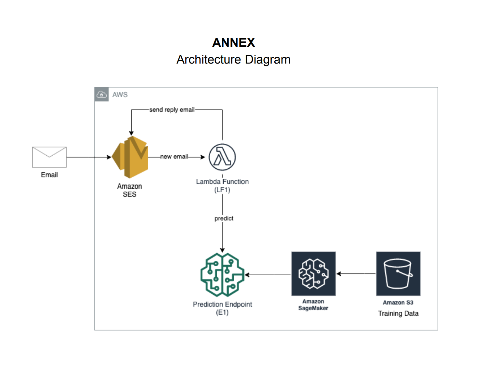

# Cloud Computing Assignment 3

# Email Spam Detection

# Summary

This is a machine learning model to predict whether a message is spam or not. After an email has been recieved it will analyze if the contents are spam or not and return results to the original sender. The model is trained on UCI SMS Spam Collection Data Set.
  
  -AWS services used: S3, SES, SageMaker, Lambda, Cloudfront 
    
- Architecture Diagram

